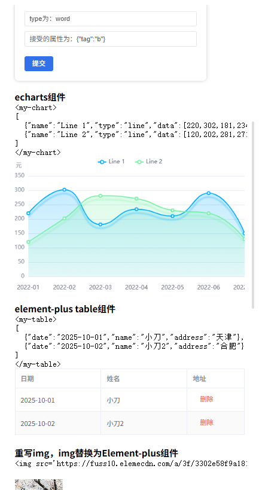

[English](README.md) | [中文](README.cn.md)

# 💠 markdown-it-fusion

>**markdown-it-fusion** is a powerful `markdown-it` plugin that allows you to seamlessly inject, render, and manage any front-end component (like Vue or React) directly within your Markdown. It is natively designed for **stream rendering**, providing a structured, component-aware output that goes far beyond flat HTML.

| | |
| :--- | :--- |
| **GitHub** | [🔗 renqiankun/markdown-it-fusion-demo](https://github.com/renqiankun/markdown-it-fusion-demo) |
| **Live Demo** | [🚀 Live Demo](https://renqiankun.github.io/markdown-it-fusion-demo/dist/) |

---


## ✨ Key Features

-   **🚀 Powerful Componentization**
    -   **Inject Any Component**: Seamlessly render any custom Vue or React component in your Markdown, breaking the limits of static text.
    -   **Standard HTML-like Syntax**: Uses an intuitive `<tag>...</tag>` style with full support for attributes, self-closing tags (`<tag />`), and implicit self-closing tags (``), ensuring a low learning curve.
    -   **Flexible Data Passing**: Pass tag content as plain text or a JSON string to your components, enabling data-driven rendering with ease.

-   **🌊 Streaming-First Architecture**
    -   **Elegant Loading Placeholders**: Choose to display a loading state or render components prematurely while data is streaming, preventing component flickering and layout shifts for a superior user experience.
    -   **Smart State Awareness**: Components know exactly when the data stream is complete, allowing you to execute specific logic (like code highlighting or chart rendering) post-load.
    -   **High-Performance Caching**: Once the data stream is complete, component props are intelligently locked to prevent unnecessary re-renders, ensuring high performance and state stability.

-   **🧩 Structured Output**
    -   **Segmented Results (`useSegments`)**: Splits the render output into an array of **HTML segments** and **component segments**, giving you full rendering control in any framework (Vue, React, Svelte, etc.).

-   **🔧 High Compatibility & Extensibility**
    -   **Native Plugin**: Built on the `markdown-it` plugin system, it doesn't interfere with core functionalities or other plugins.
    -   **Dual-Mode Compatibility**: Works consistently whether `markdown-it`'s `html` option is enabled or disabled.
    -   **Decoupled & Extensible**: Features a clean architecture that is easy to modify and integrate with other `markdown-it`-based libraries.

---

## 📦 Installation

```bash
# Using npm
npm install markdown-it-fusion

# Or using yarn
yarn add markdown-it-fusion
```

---

## 🚀 Quick Start

### 1.1. Initialize the Plugin

First, import and use the plugin with your `markdown-it` instance.

```ts
import MarkdownIt from 'markdown-it'
import mdFusion, {
  useSegments,
  useInstanceId,
  destroy,
  type MDComponentOptions,
  type SegmentsResultItem
} from 'markdown-it-fusion'
import 'markdown-it-fusion/style.css'
// Your Vue or React component
const MyComponent = { /* ... Component definition ... */ }

const md = new MarkdownIt()

// Minimal configuration example
md.use(mdFusion, {
  components: {
    'my-component': { component: MyComponent }
  }
})
```
### 1.2. Use the Plugin
```ts
const html = md.render(' Markdown use <my-component>com</my-component>')
// After obtaining the segments, traverse the segments in Vue or React to render HTML fragments or components.
const { id, segments } = useSegments(html)
```


### 2. Render in Vue

Use the `useSegments` helper to get HTML and component segments, then render them dynamically in your template.

```vue
<template>
  <div class="content">
    <template v-for="item in segments" :key="item.id">
      <div v-if="item.type === 'html'" v-html="item.content"></div>
      <component v-else-if="item.type === 'component'" :is="item.component" v-bind="item.props" />
    </template>
  </div>
</template>

<script setup>
import { ref, computed, onBeforeUnmount, shallowRef } from 'vue'
import MarkdownIt from 'markdown-it'
import mdFusion, { useSegments, destroy } from 'markdown-it-fusion'

// Example component definition
import MyComponent from './MyComponent.vue'

// Instantiate markdown-it and use the plugin
const md = MarkdownIt().use(mdFusion, {
  components: {
    // Use shallowRef or a string (the component needs to be matched later by yourself)
    'my-component': { component: shallowRef(MyComponent) }
  }
})

const markdownText = ref('Using <my-component>component</my-component> in Markdown')

const renderedResult = computed(() => {
  const html = md.render(markdownText.value)
  return useSegments(html)
})

const segments = computed(() => renderedResult.value.segments)
const instanceId = computed(() => renderedResult.value.id)

// Clean up the instance cache when the component is unmounted
onBeforeUnmount(() => {
  if (instanceId.value) {
    destroy(instanceId.value)
  }
})
</script>
```

### 3. Render in React

The logic is similar to Vue. Use `useMemo` for efficient rendering.
The component cache logic keeps the references of props and _attrs passed to the component unchanged.


---

## ⚙️ API & Options

### Top-Level Plugin Options (`MDComponentPluginOptions`)

| Parameter | Type | Default | Description |
| :--- | :--- | :--- | :--- |
| **`components`** | `Record<string, MDComponentOptions>` | **Required** | A map of registered components. |
| `placeholderClass` | `string` | `'custom-placeholder'` | Global CSS class for component placeholders. |
| `propsKey` | `string` | `'_data'` | Global prop name for passing tag content. |
| `debug` | `boolean` | `false` | Enable debug mode for detailed logging. |

### Individual Component Options (`MDComponentOptions`)

| Parameter | Type | Default | Description |
| :--- | :--- | :--- | :--- |
| **`component`** | `any` | **Required** | The component object to render (Vue/React) or string |
| `renderIntermediate` | `boolean` | `false` | Whether to render the component before the data stream is complete. |
| `loadingText` | `string` | `'Loading...'` | Placeholder text to display when `renderIntermediate` is `false`. |
| `propsUseJson` | `boolean` | `false` | Whether to attempt parsing tag content as JSON. |
| `multipleProps` | `boolean` | `false` | If `propsUseJson` succeeds, whether to spread the JSON object as multiple props. |
| `propsKey` | `string` | `'_data'` | Overrides the global `propsKey` for this component. |
| `placeholderClass` | `string` | `'custom-placeholder'` | Overrides the global `placeholderClass` for this component. |

### Helper Functions

#### 1. `useSegments(html)`

Parses the HTML string from `md.render()` and returns a structured list of segments.

-   **Returns**: `{ id: string, segments: SegmentsResultItem[] }`

**`SegmentsResultItem` Object Structure**:

```ts
{
  type: 'html' | 'component', // Segment type
  id: string,                 // Unique ID
  content?: string,           // HTML content (only for type: 'html')
  component?: any,            // Component object (only for type: 'component')
  props?: {
    [key: string]: any,
    _attrs?: Record<string, any>, // All HTML attributes from the tag
    _isComplete?: boolean         // Whether the data stream is complete
  }
}
```

#### 2. `destroy(instanceId?)`

Destroys and cleans up the cache. This is crucial in Single Page Applications (SPAs) to prevent memory leaks.

-   **`instanceId`** (optional): The ID obtained from `useSegments` or `useInstanceId`. If provided, only that instance is destroyed; if omitted, all caches will be destroyed.

```ts
import { useInstanceId, destroy } from 'markdown-it-fusion'

// Get the instance ID from useSegments or useInstanceId
// const { id } = useSegments(html)
const id = useInstanceId(html)

// Destroy a specific instance
destroy(id)

// Destroy all instances
destroy()
```

---

## ⚠️ Important Notes

-   **Dependencies**: The plugin requires `markdown-it`.
-   **JSON Parsing**: When `propsUseJson: true`, if JSON parsing fails, the content will fall back to a plain string.
-   **Streaming**: Use the `renderIntermediate` option to control placeholder behavior during streaming.
-   **Memory Management**: In SPA environments like Vue or React, always call `destroy()` when the component unmounts to clean up the cache.

---

## 📜 License

MIT